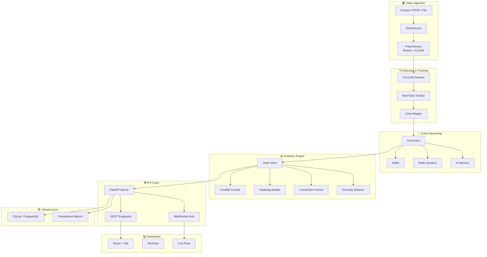

# Store Intelligence System


> Real-time computer vision analytics for retail stores — detects, tracks, and analyses customer behaviour across store zones using YOLOv8, ByteTrack, and streaming event architecture.

---

## Architecture



---

## Features

| Feature | Description |
|---------|-------------|
| **Real-time Person Detection** | YOLOv8n with ByteTrack for multi-person tracking at configurable FPS |
| **Zone Analytics** | Polygon-based zone mapping with dwell time, occupancy, and visit counting |
| **Conversion Funnel** | Entrance → Product → Engagement → Checkout journey tracking |
| **Heatmap Generation** | Normalised zone intensity based on visit frequency and dwell time |
| **Anomaly Detection** | 5 rules: crowd surge, loitering, queue overflow, after-hours, Z-score |
| **Streaming Events** | Pluggable backends: Kafka, Redis Streams, or in-memory |
| **REST + WebSocket API** | Full CRUD with filtering, pagination, and real-time event push |
| **React Dashboard** | Live charts, zone overlays, anomaly alerts, conversion funnel |
| **Prometheus Metrics** | Request latency histograms, event counters, pipeline health |
| **Multi-Camera Support** | Each camera runs an independent ingestion pipeline |

---

## Quick Start

### With Docker (recommended)

```bash
# Clone the repository
git clone https://github.com/your-org/store-intelligence.git
cd store-intelligence

# Copy environment config
cp .env.example .env

# Generate a test video
pip install opencv-python numpy
python scripts/generate_test_video.py

# Start all services
docker compose up -d

# Browse
#   Dashboard:  http://localhost:5173
#   API docs:   http://localhost:8000/docs
#   Health:     http://localhost:8000/api/v1/health
```

### Without Docker (local development)

```bash
# Create virtual environment
python -m venv .venv
.venv\Scripts\activate        # Windows
# source .venv/bin/activate   # macOS/Linux

# Install dependencies
pip install -r requirements.txt

# Copy environment config
cp .env.example .env

# Generate test video
python scripts/generate_test_video.py

# Run the API server
uvicorn api.main:app --reload --port 8000

# Run tests
pytest tests/ -v --tb=short
```

---

## API Reference

All endpoints return the standard `ApiResponse` envelope:

```json
{
  "status": "success",
  "data": { ... },
  "meta": { "timestamp": "...", "request_id": "..." },
  "error": null
}
```

### Health

```bash
curl http://localhost:8000/api/v1/health
```

### Footfall Analytics

```bash
curl http://localhost:8000/api/v1/analytics/footfall
```

### Zone Statistics

```bash
curl http://localhost:8000/api/v1/analytics/zones
```

### Zone Heatmap

```bash
curl http://localhost:8000/api/v1/analytics/heatmap
```

### Conversion Funnel

```bash
curl http://localhost:8000/api/v1/analytics/funnel
```

### Peak Hours

```bash
curl http://localhost:8000/api/v1/analytics/peak-hours
```

### Events (paginated)

```bash
curl "http://localhost:8000/api/v1/events?page=1&page_size=20"
```

### Anomalies

```bash
# All anomalies
curl http://localhost:8000/api/v1/anomalies

# Active only
curl http://localhost:8000/api/v1/anomalies/active

# Resolve an anomaly
curl -X POST http://localhost:8000/api/v1/anomalies/{id}/resolve \
  -H "Content-Type: application/json" \
  -d '{"notes": "False alarm, staff event"}'
```

### Cameras

```bash
curl http://localhost:8000/api/v1/cameras
```

### WebSocket (real-time events)

```javascript
const ws = new WebSocket("ws://localhost:8000/ws/events?types=zone_enter,zone_exit&zone=entrance");
ws.onmessage = (msg) => console.log(JSON.parse(msg.data));
```

---

## Project Structure

```
store-intelligence/
├── api/
│   ├── __init__.py
│   ├── middleware.py          # CORS, request ID, timing, rate limiting
│   ├── schemas.py             # Pydantic models & API envelope
│   ├── websocket.py           # WebSocket connection manager
│   └── routers/
│       ├── __init__.py
│       └── health.py          # GET /health
├── analytics/
│   ├── __init__.py
│   └── store.py               # Thread-safe in-memory state store
├── config/
│   ├── __init__.py
│   ├── settings.py            # Pydantic BaseSettings (all env vars)
│   └── zones.json             # Zone polygon definitions
├── db/
│   ├── __init__.py
│   ├── models.py              # SQLAlchemy ORM models
│   └── session.py             # Async session factory
├── pipeline/
│   ├── __init__.py
│   ├── ingestion.py           # VideoSource + frame preprocessing
│   └── detector.py            # YOLOv8 detector + tracker
├── streaming/
│   ├── __init__.py
│   └── base.py                # Abstract StreamBackend interface
├── scripts/
│   └── generate_test_video.py # Synthetic test video generator
├── tests/
│   ├── __init__.py
│   ├── conftest.py            # Shared fixtures
│   ├── test_pipeline.py       # Video source, preprocessing, zones
│   ├── test_api.py            # All REST endpoint tests
│   ├── test_anomaly.py        # Anomaly rule tests
│   └── test_analytics.py      # Footfall, heatmap, funnel tests
├── test_data/                 # Generated test videos
├── docker-compose.yml         # Full stack: app, dashboard, Kafka, Redis
├── Dockerfile                 # Python app container
├── Dockerfile.dashboard       # React dashboard (multi-stage)
├── requirements.txt           # Python dependencies
├── .env.example               # Environment variable template
├── .gitignore
└── README.md
```

---

## Design Decisions & Trade-offs

### In-Memory State Store

The `StateStore` uses a thread-safe in-memory design with `threading.RLock` rather than Redis or a database for the hot path. This gives sub-millisecond reads for the API and analytics layers. Events are also persisted to SQLite/PostgreSQL asynchronously for durability.

**Trade-off:** State is lost on restart. In production, you'd add a startup rehydration step from the database or use Redis as the primary store.

### Pluggable Streaming Backends

The `StreamBackend` ABC lets you swap between Kafka (production), Redis Streams (staging), and in-memory (development) without changing any pipeline code.

**Trade-off:** The in-memory backend doesn't survive restarts and has no partitioning. Kafka provides durability and horizontal scaling.

### Zone Mapper as Polygon Test

Zone detection uses `cv2.pointPolygonTest` rather than grid-based pixel mapping. This is more flexible (arbitrary polygons) and simpler to configure via JSON.

**Trade-off:** Slightly more expensive per-point than a lookup table, but negligible at 5-15 FPS with <100 tracked people.

### CLAHE Preprocessing

Optional CLAHE (Contrast Limited Adaptive Histogram Equalisation) on the L channel in LAB colour space improves detection accuracy in stores with inconsistent lighting.

**Trade-off:** ~2ms per frame overhead. Disabled by default in tests.

### Anomaly Detection: Rules + Statistics

Anomaly detection combines hard-coded business rules (crowd surge, loitering, queue length, after-hours) with a statistical Z-score detector on rolling windows. This avoids the cold-start problem of pure ML anomaly detection.

**Trade-off:** Z-score requires at least 10 data points to establish a baseline. Rule thresholds need manual tuning per store.

---

## What Would Be Added with More Time

- **Re-identification**: Cross-camera person re-ID using appearance feature embeddings
- **GPU acceleration**: TensorRT-optimised YOLO inference for 30+ FPS
- **Alerting**: Slack/email/PagerDuty webhook integrations for anomalies
- **Historical analytics**: Time-series database (TimescaleDB) for trend analysis
- **A/B zone testing**: Compare different store layouts via zone reconfiguration
- **Authentication**: JWT-based API auth with role-based access control
- **Kubernetes deployment**: Helm charts with HPA for auto-scaling
- **MLflow integration**: Track model versions and detection performance
- **Edge deployment**: ONNX export for running on Jetson Nano / Raspberry Pi
- **Data export**: CSV/PDF report generation for store managers

---

## Running Tests

```bash
# All tests with verbose output
pytest tests/ -v

# With coverage report
pytest tests/ --cov=analytics --cov=pipeline --cov=api --cov-report=term-missing

# Specific test module
pytest tests/test_anomaly.py -v

# Run with markers
pytest tests/ -v -k "not integration"
```

---

## Environment Variables

All settings are configurable via environment variables or a `.env` file. See [`.env.example`](.env.example) for the complete reference with defaults and descriptions.

Key variables:

| Variable | Default | Description |
|----------|---------|-------------|
| `VIDEO_FPS` | `5` | Frames per second to process |
| `YOLO_MODEL` | `yolov8n.pt` | YOLO model checkpoint |
| `CONFIDENCE_THRESHOLD` | `0.4` | Detection confidence cutoff |
| `STREAM_BACKEND` | `memory` | `kafka`, `redis`, or `memory` |
| `CROWD_THRESHOLD` | `10` | Max people per zone before alert |
| `LOITERING_THRESHOLD_SECONDS` | `300` | Dwell time before loitering alert |
| `BUSINESS_HOURS_START` | `9` | Store opens (24h format) |
| `BUSINESS_HOURS_END` | `21` | Store closes (24h format) |

---

## License

MIT License — see [LICENSE](LICENSE) for details.
